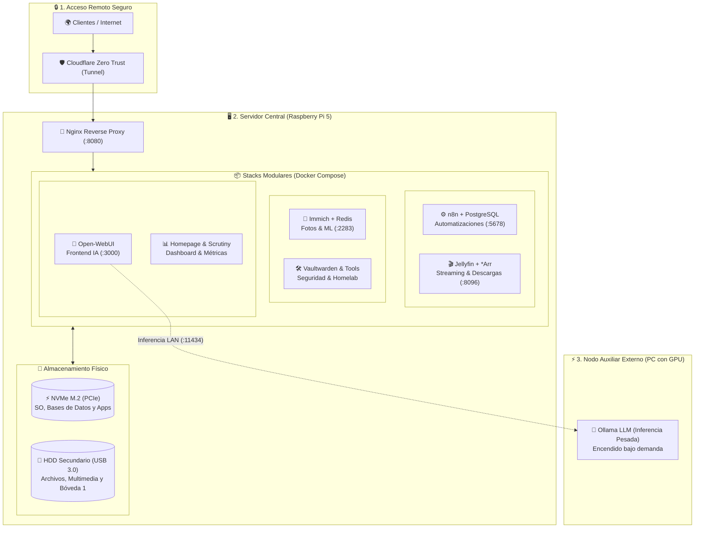
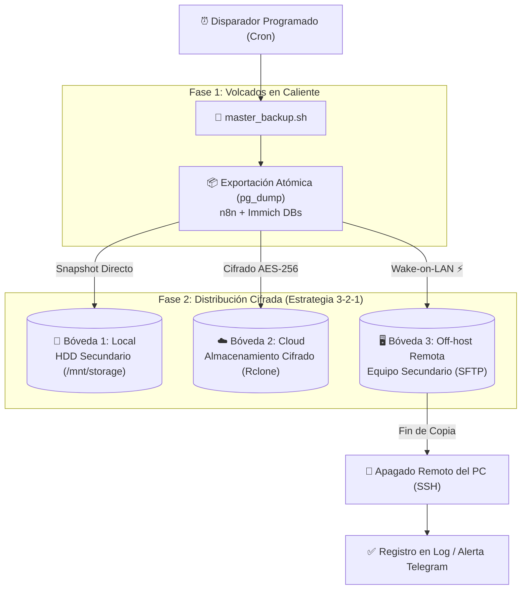

# 🚀 Modular Homelab — Infrastructure as Code (IaC)

[](#especificaciones-de-hardware-y-almacenamiento)
[](#especificaciones-de-hardware-y-almacenamiento)
[](#despliegue-modular-con-docker)
[](#estrategia-de-backups-3-2-1-con-restic)
[](#seguridad-y-acceso-remoto)
[](#-validación-y-calidad-continua-cicd)

Plantilla e infraestructura como código (IaC) modular para un servidor homelab autoalojado de alta disponibilidad, eficiencia energética y resiliencia de datos, implementado sobre **Raspberry Pi 5**.

> **Resumen de Arquitectura:**  
> Servidor local en **Raspberry Pi 5** con almacenamiento segmentado **NVMe/HDD**, despliegue modular desacoplado mediante **Docker Compose**, acceso remoto securizado vía **Cloudflare Tunnels (Zero Trust)** y copias de seguridad automatizadas con **Restic hacia 3 bóvedas independientes (Estrategia 3-2-1)**.

---

## 📐 Diagrama de Arquitectura Global



---

## 🛠️ Especificaciones de Hardware y Almacenamiento

El diseño desacopla las cargas de trabajo según su perfil de I/O para maximizar durabilidad y rendimiento:

| Nivel | Tipo de Unidad | Función en la Infraestructura |
| :--- | :--- | :--- |
| **Nodo Central** | Raspberry Pi 5 (ARM64) | Computación continua de bajo consumo (típico < 10-12W) |
| **Tier 1 (Rápido)** | SSD NVMe M.2 (vía PCIe HAT) | Sistema operativo, volúmenes de configuración y bases de datos transaccionales (PostgreSQL, SQLite, Redis) |
| **Tier 2 (Masivo)** | HDD SATA Secundario (vía USB 3.0 UASP) | Biblioteca multimedia, descargas masivas y primera bóveda de copias locales |
| **Aceleración GPU** | Núcleo gráfico con `/dev/dri` | Transcodificación de vídeo por hardware en el servidor multimedia |

### 💾 Configuración de Almacenamiento Masivo y Recomendaciones de Disco

Para garantizar la integridad a largo plazo y evitar fallos bajo cargas continuas de lectura/escritura (backups de Restic, streaming y descargas), la infraestructura utiliza la variable de entorno `STORAGE_PATH` (por defecto `/mnt/storage`).

#### 💡 Consejos para la Elección del Disco Duro (HDD):
1. **Tecnología CMR obligatoria (evitar SMR):**  
   Los discos con tecnología **SMR (Shingled Magnetic Recording)** colapsan en velocidad de escritura cuando se ejecutan tareas intensivas de E/S aleatoria o snapshots diferenciales de Restic. Utiliza siempre unidades con grabación magnética convencional (**CMR / PMR**).
2. **Gamas para Servidores y NAS 24/7:**  
   - Emplea unidades certificadas para trabajo continuo en entornos NAS/Enterprise con tolerancia a vibración rotacional.
   - Verifica en la hoja técnica del fabricante que la unidad especifique expresamente grabación convencional (**CMR**).
3. **Sistema de Archivos y Montaje Persistente:**  
   - Formato recomendado: **`ext4`** (robusto y con mínimo consumo de CPU en placas ARM) o **`btrfs`** (para detección de bit-rot mediante checksums).
   - Configura el montaje permanente en `/etc/fstab` utilizando el **`UUID`** del disco (`blkid`) en lugar de rutas dev volátiles como `/dev/sda1`.
   ```bash
   # Ejemplo de línea en /etc/fstab:
   UUID=XXXXXXXX-XXXX-XXXX-XXXX-XXXXXXXXXXXX /mnt/storage ext4 defaults,noatime,nofail 0 2
   ```

---

## 🖥️ Integración con Nodos Auxiliares Externos (PC / GPU)

La arquitectura sigue el principio de **separación de responsabilidades**:
- **Raspberry Pi 5 (Servidor 24/7):** Se encarga de la orquestación, automatizaciones, descargas, proxies y almacenamiento continuo.
- **PC o Servidor Auxiliar con GPU (Bajo Demanda):**  
  Las tareas que requieren aceleración pesada por GPU (como inferencia de modelos LLM con Ollama) o almacenamiento de respaldo secundario no sobrecargan la Pi:
  1. **Inferencia LLM:** El frontend Open-WebUI en la Pi se comunica con el servidor Ollama a través de la red local (`OLLAMA_BASE_URL=http://${EXTERNAL_LLM_HOST}:11434`), permitiendo encender la máquina con GPU solo cuando se requiere.
  2. **Respaldo Off-host:** El script de backup enciende el equipo secundario automáticamente mediante Wake-on-LAN cuando necesita realizar la copia y lo apaga al finalizar.

---

## 📦 Mapa de Servicios y Puertos

Cada servicio se ejecuta de forma modular y contenida dentro de su propio subdirectorio con variables de entorno desacopladas:

| Stack | Servicios Contenidos | Puerto Local | Propósito Principal |
| :--- | :--- | :--- | :--- |
| [`automation`](automation/) | n8n, PostgreSQL | `5678` | Orquestación de flujos de trabajo y webhooks |
| [`media`](media/) | Jellyfin | `8096` | Streaming multimedia con aceleración por hardware |
| [`photos`](photos/) | Immich Server, Machine Learning, PostgreSQL (pgvector), Redis | `2283` | Gestión, respaldo y clasificación neuronal de fotos |
| [`music`](music/) | Navidrome, Deemix | `4533`, `6595` | Servidor de streaming musical compatible con Subsonic |
| [`arr-stack`](arr-stack/) | Gluetun (WireGuard VPN), qBittorrent, Sonarr, Radarr, Prowlarr, Jackett, Flaresolverr, Jellyseerr, Unpackerr | Varios | Gestión automatizada de medios y clientes P2P (entorno de pruebas/educativo) |
| [`ai`](ai/) | Open-WebUI | `3000` | Interfaz conversacional para modelos LLM locales |
| [`deep-research`](deep-research/) | GPT-Researcher | `8000` | Motor autónomo de investigación profunda y contraste de fuentes (Cloud/Ollama) |
| [`timeseries-analytics`](timeseries-analytics/) | TimescaleDB, Grafana, Predictive Engine | `3030`, `5435` | Ingesta de datos temporales y predicción de series analíticas |
| [`geospatial-monitor`](geospatial-monitor/) | Plataforma Geoespacial | `4173` | Monitorización geoespacial, telemetría y cartografía en tiempo real |
| [`voice-assistant`](voice-assistant/) | Asistente de Voz Inteligente | *Host* | Control por voz y pasarela WebSocket para domótica |
| [`homeassistant`](homeassistant/) | Home Assistant Core | `8123` | Domótica del hogar, mDNS/SSDP (`host network`) |
| [`tools/cloudflare`](tools/cloudflare/) | Cloudflared | *Host* | Túnel saliente cifrado Zero Trust |
| [`tools/guacamole`](tools/guacamole/) | Apache Guacamole | `8088` | RDP / VNC web seguro cliente-libre con 2FA TOTP |
| [`tools/vaultwarden`](tools/vaultwarden/) | Vaultwarden (Bitwarden) | `8082` | Gestor de contraseñas privado con SQLite WAL |
| [`tools/homepage`](tools/homepage/) | Homepage Dashboard | `3001` | Cuadro de mando unificado y métricas del sistema |
| [`tools/scrutiny`](tools/scrutiny/) | Scrutiny Omnibus | `8086` | Monitorización continua de salud SMART de discos |
| [`tools/uptime-kuma`](tools/uptime-kuma/) | Uptime Kuma | `3002` | Monitorización de uptime y sondas de disponibilidad |
| [`tools/gitea`](tools/gitea/) | Gitea | `3050` | Control de versiones y repositorios Git locales |
| [`tools/filebrowser`](tools/filebrowser/) | FileBrowser | `8081` | Explorador y gestor web de archivos locales |
| [`web`](web/) | Nginx Reverse Proxy | `8080` | Enrutador estático y proxy inverso de baja latencia |

> ⚖️ **Aviso Legal y Uso Educativo:**  
> Los servicios de gestión de medios y descargas (`arr-stack`, `music`) se incluyen en este repositorio exclusivamente con fines **educativos, de investigación de redes y para la administración de bibliotecas de dominio público o bajo licencias libres**. Este proyecto no promueve, avala ni facilita la vulneración de derechos de autor ni la descarga no autorizada de material protegido por copyright.

---

## 🔒 Seguridad y Acceso Remoto

1. **Zero NAT / Zero Port Forwarding:**  
   Ningún puerto de la red local está abierto hacia Internet en el router. El acceso externo se gestiona a través de **Cloudflare Tunnels (`cloudflared`)**, aplicando políticas Zero Trust y autenticación previa.
2. **Aislamiento de Tráfico P2P:**  
   El cliente de descargas (`qBittorrent`) carece de interfaz de red pública física: utiliza `network_mode: service:vpn` acoplado al contenedor **Gluetun**, garantizando que todo el tráfico pasa por un túnel **WireGuard** con parada total de emergencia (*kill-switch*).
3. **Consistencia Criptográfica y WAL:**  
   Bases de datos como SQLite (Vaultwarden) implementan `ENABLE_DB_WAL=true` para garantizar consistencia atómica y lecturas seguras sin bloqueo durante los procesos de respaldo.

---

## 🛡️ Estrategia de Backups 3-2-1 con Restic

El script central [`master_backup.sh`](master_backup.sh) orquesta periódicamente copias de seguridad automatizadas con retención diferencial e integridad criptográfica:



### Características de la Estrategia:
- **Volcado Atómico en Caliente:** Exportación previa con `pg_dump` de las bases de datos de `n8n` e `Immich` antes del snapshot de archivos.
- **Deduplicación y Cifrado:** Todos los datos se deduplican en bloques y se cifran en origen con AES-256 antes de transmitirse.
- **Gestión Inteligente de Energía (Wake-on-LAN):**  
  Si el equipo secundario está apagado, el script envía un paquete mágico WoL, espera a que el servicio SSH esté disponible, completa el snapshot y ejecuta un apagado remoto ordenado.
- **Limpieza y Retención:** Política con `--keep-daily 7 --keep-weekly 4 --keep-monthly 6`, ejecutando `prune` físico programado.
- **Alertas Silenciosas:** Alertas automáticas vía **Telegram Bot API** enviadas únicamente si se produce algún fallo durante la ejecución.

> 📖 **Procedimientos Operativos:** Para instrucciones paso a paso sobre cómo restaurar servicios o bases de datos en producción ante incidentes, consulta el [🚑 Runbook de Recuperación ante Desastres (Disaster Recovery)](docs/disaster-recovery.md).

---

## 🚀 Despliegue Seguro con `deploy.sh`

Para evitar inconsistencias o interrupciones de servicio, los despliegues siguen un protocolo estricto mediante [`deploy.sh`](deploy.sh):

```bash
# Ejemplo: Desplegar o actualizar el stack de Homepage
./deploy.sh tools/homepage

# Ejemplo: Desplegar el stack de automatizaciones
./deploy.sh automation
```

### Flujo de Ejecución de `deploy.sh`:
1. **Detección Automática:** Distingue si se trata de un nuevo servicio o una actualización de un stack en ejecución.
2. **Snapshot en Frío (Safe Point):** Antes de descargar código nuevo o detener contenedores en producción, empaqueta el directorio del stack en `${STORAGE_PATH:-/mnt/storage}/deploy_backups/<stack>_<timestamp>.tar.gz`. *Sin snapshot válido, el despliegue se aborta inmediatamente*.
3. **Sincronización:** Ejecuta `git pull` de las ramas oficiales.
4. **Reinicio Seguro:** Ejecuta `docker compose up -d` verificando el estado de salida. Si ocurre un fallo, el servicio vuelve al estado previo respaldado.

---

## 🧠 Decisiones de Ingeniería y Trade-offs (ADRs)

| Decisión Técnica | Alternativa Evaluada | Justificación / Trade-off Seleccionado |
| :--- | :--- | :--- |
| **Raspberry Pi 5 + NVMe HAT** | Servidor x86 antiguo / Mini PC | Consumo continuo inferior a 12W 24/7 (reducción radical de coste energético y calor), silencio pasivo y línea PCIe directa a NVMe que evita cuellos de botella en buses USB. |
| **Cloudflare Tunnels (Zero Trust)** | DDNS + Apertura de puertos (Port Forwarding 80/443) | Eliminación total de superficie de ataque externa en el router. No se expone la IP residencial y se aprovecha la mitigación DDoS y filtrado perimetral de Cloudflare. |
| **Restic + Rclone (3-2-1)** | Duplicati / BorgBackup | Restic implementa deduplicación nativa a nivel de bloque en snapshots independientes, cifrado integral autenticado (AES-256 / Poly1305) e interoperabilidad nativa con múltiples nubes vía Rclone. |
| **Aislamiento de Red con Gluetun** | VPN global en el Host (SO) | Mediante `network_mode: service:vpn`, solo los contenedores de descargas enrutan su tráfico por WireGuard con kill-switch estricto, sin penalizar la velocidad de la LAN ni desconectar las interfaces locales del servidor. |
| **Segmentación NVMe vs HDD** | Almacenamiento homogéneo en un solo medio | Se reservan los ciclos de lectura/escritura aleatoria (IOPS) del SSD NVMe para PostgreSQL, SQLite y logs transaccionales, derivando lecturas secuenciales pesadas (vídeo, fotos, copias) al HDD SATA secundario. |

---

## 📊 Observabilidad, Métricas y Telemetría

La infraestructura integra monitorización proactiva para anticipar fallos de hardware y degradación de red:

- **Telemetría S.M.A.R.T de Discos ([Scrutiny](tools/scrutiny/)):** Supervisión continua de sectores reasignados, temperaturas y curvas de desgaste de las unidades NVMe y HDD mediante demonios de bajo nivel (`SYS_RAWIO`).
- **Sondas de Disponibilidad y SLA ([Uptime Kuma](tools/uptime-kuma/)):** Verificación en intervalos regulares de la salud HTTP/TCP/DNS de cada contenedor con alertas multicanal.
- **Series Temporales y Visualización ([Grafana](timeseries-analytics/)):** Cuadros de mando analíticos sobre métricas persistidas en TimescaleDB.

---

## 🤖 Validación y Calidad Continua (CI/CD)

El repositorio cuenta con un pipeline automatizado en **GitHub Actions** ([`.github/workflows/ci.yml`](.github/workflows/ci.yml)) que garantiza la integridad de la infraestructura antes de cada fusión:

1. **Linting de Shell Scripts (`ShellCheck`):** Análisis estático de buenas prácticas, prevención de inyecciones de variables y cumplimiento POSIX en `deploy.sh` y `master_backup.sh`.
2. **Validación Sintáctica de Stacks (`Docker Compose Config`):** Comprobación en seco de dependencias, variables requeridas y parsing YAML de cada archivo `docker-compose.yml`.
3. **Escaneo de Fugas de Seguridad (`Gitleaks`):** Detección automatizada de contraseñas, certificados o tokens privados accidentales en el historial de commits.

---

## 💻 Inicio Rápido (Quick Start)

### 1. Clonar el repositorio
```bash
git clone https://github.com/severisoler-cpu/modular-homelab-iac.git ~/homelab
cd ~/homelab
```

### 2. Configurar variables de entorno
Cada stack cuenta con su archivo de plantilla `.env.example`. Crea los `.env` correspondientes rellenando tus credenciales:
```bash
# Ejemplo para n8n / automatización
cp automation/.env.example automation/.env
nano automation/.env

# Ejemplo para Immich
cp photos/.env.example photos/.env
nano photos/.env
```

### 3. Configurar secretos de backup
```bash
cp .backup_secrets.example .backup_secrets
chmod 600 .backup_secrets
nano .backup_secrets
```

### 4. Desplegar un stack
```bash
chmod +x deploy.sh master_backup.sh
./deploy.sh tools/homepage
```

---

## 📄 Licencia

Este repositorio de infraestructura se distribuye bajo la licencia **MIT**. Consulta el archivo `LICENSE` para más detalles.
